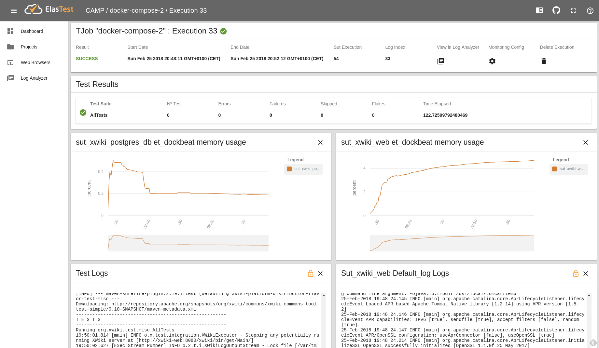

# Elastest-CAMP integration

This repository contains a small python script to add multi-configurations generated by the CAMP set of tools to ElasTest, and run them there. The idea is to provide useful information when running those configurations, like memory usage, cpu usage or logs of the different components involved.

The repository contains a sample docker-file generated with CAMP that can be used as a sample. 

To try it out first ElasTest must be started:

    docker run --rm -v /var/run/docker.sock:/var/run/docker.sock elastest/platform:dev start

Note that if ElasTest fails to start it might be caused by well-known problem with ElasticSearch. In that case, the following could solve the problem:

    sudo sysctl -w vm.max_map_count=262144

Then the python script can be run issuing the following command:
    
    python elastest-import-py

It will create a CAMP project with a SUT and a TJob. The SUT will be based on a modified version of the docker-compose file provided as part of this repository. The TJob will wun the test container against the SUT. The TJob will be run automatically upon creation.

When finish, the output of the TJob should show something like:

